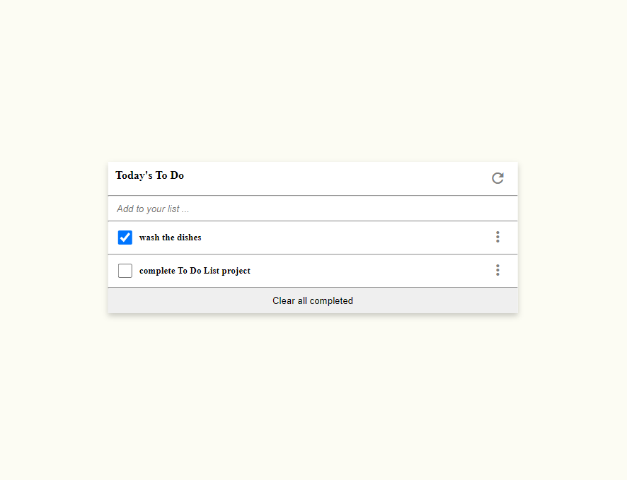

# To Do List

> To Do List
<!--  -->

<!-- ## You can access the live portfolio [here](https://bavon101.github.io/my_portfolio/#About) -->

Additional description about the project and its features.
## Screenshots Desktop 📷

## Screenshots Mobile 📷📲

## Built With

- HTML/CSS
- JS
- WebPack

## Live Demo

[Live Demo Link](https://bavon101.github.io/todoList/dist/)

## Getting Started

**This is the starting point of my To Do List, built with newly acquired skills**

<!-- To get a local copy up and running follow these simple example steps.

### Prerequisites

### Setup

### Install

### Usage

### Run tests

### Deployment -->

## Authors

👤 **Author**

- GitHub: [@Bavon101](https://github.com/Bavon101)

## 🤝 Contributing

Contributions, issues, and feature requests are welcome!

Feel free to check the [issues page](../../issues/).

## Show your support

Give a ⭐️ if you like this project! and cheers✨

## Acknowledgments

- Microverse offered guidance on how to make the project more professional

## 📝 License

This project is [MIT](./MIT.md) licensed.